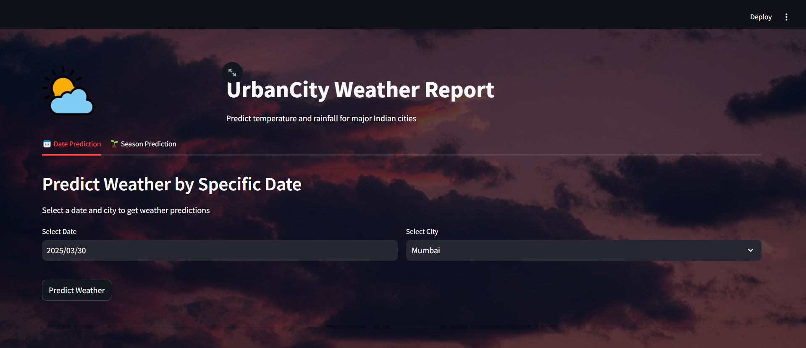
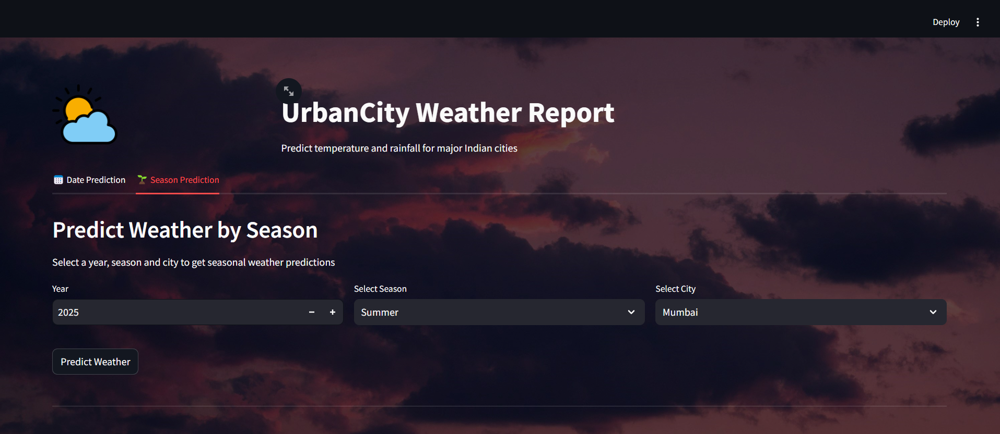
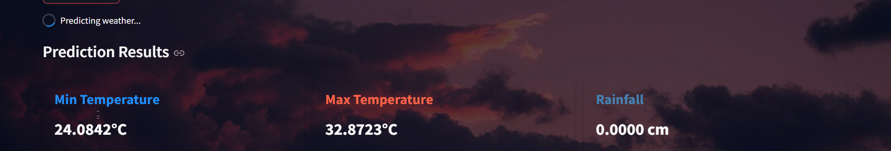
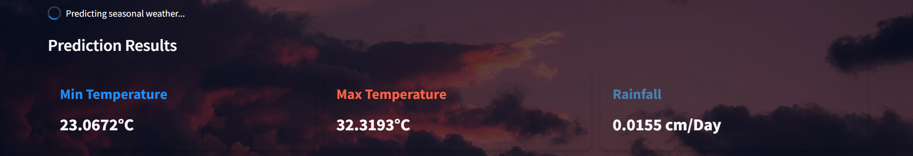
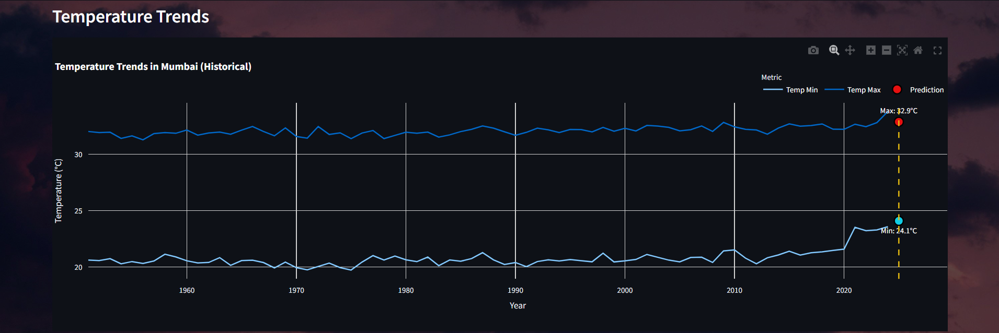
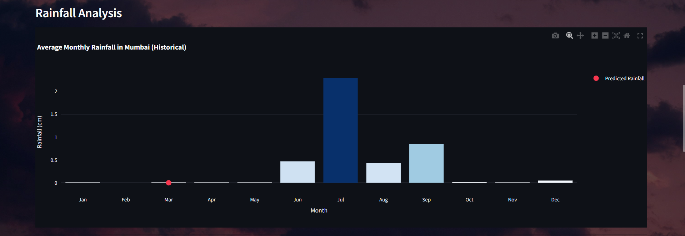
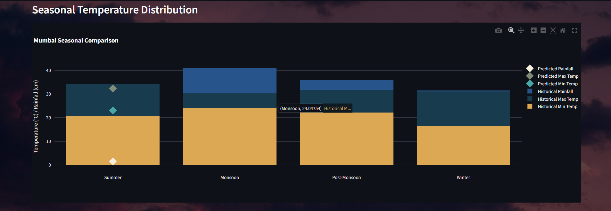
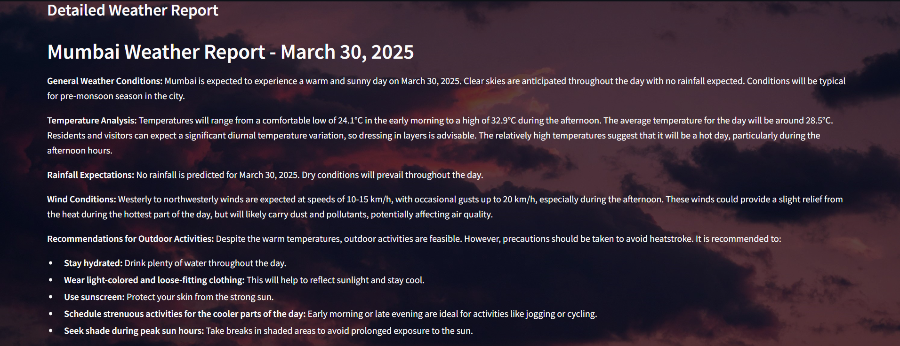

# UrbanCity Weather Report

## Problem Statement
- Weather impacts everything from daily life to major industries. Farmers depend on forecasts to protect crops, travelers plan around weather conditions, and emergency responders prepare for disasters. However, traditional methods often fail to capture complex temperature patterns, leading to inaccurate predictions and costly disruptions.
- A smarter, data-driven approach is needed—one that not only improves temperature forecasting but also provides interactive insights to help users spot trends, identify anomalies, and make informed decisions.

## Dataset Description
The dataset used in this project consists of historical weather records containing attributes like max temperature and min temperature in Degree Celsius for 1951-2024 for major Indian cities like **Delhi, Kolkata, Mumbai, Chennai, Bengaluru, Ahmedabad, Hyderabad, and Pune**. To enhance the model’s robustness and generalization, we combined the data from these cities into a single dataset, allowing for a more comprehensive analysis of seasonal trends. The dataset includes the following attributes:

- **Date**: The date of the recorded weather data.
- **City**: The city where the weather was recorded.
- **Temp Max (°C)**: The maximum temperature recorded on a given day.
- **Temp Min (°C)**: The minimum temperature recorded on a given day.
- **Rain (cm)**: The total rainfall recorded in centimeters.
 
This data was preprocessed to handle missing values, normalize temperature variations, and segment the data based on seasonal changes.

## Solution Approach
The project is divided into the following key steps:

### 1. Data Preprocessing
- **Missing Value Handling**: Missing temperature and rainfall values were filled using the median value for the same city and month across years.
- **Season Encoding**: The Month column was mapped to seasons dynamically, considering that different cities have varying season durations and start times.
- **Feature Encoding**: Cities were converted into numerical labels.

### 2. Feature Engineering
We extract meaningful features from the Date column:
- **Year** - Extracts the year from the date.
- **Month** - Extracts the month (1-12).
- **Day** - Extracts the day of the month.
- **Weekday** - Extracts the day of the week (0 = Monday, 6 = Sunday).
- **Season** - Groups months into seasons (Summer, Monsoon, Post-Monsoon, Winter).

Additionally, we encode the City column using Label Encoding, converting categorical city names into numerical values.

- **Cyclic Feature Engineering**: Incorporates time-based cyclic features for better seasonality handling.

### 3. Selecting Features and Targets
- **Input Features**: Year, Month, Day, Weekday, Season, City_Encoded
- **Target Variables**: Temp Min, Temp Max, Rain

### 4. Model Comparison

| Model                | RMSE      |
|----------------------|-----------|
| Linear Regression    | 1.0187    |
| Random Forest        | 0.9784    |
| Gradient Boosting    | 0.9954    |
| XGBoost              | **0.9528** (Best) |
| LightGBM             | 0.9579    |
| Decision Tree        | 1.3825    |
| Extra Trees          | 0.9772    |
| HistGradientBoosting | 0.9593    |
| Ridge Regression     | 1.0187    |
| Lasso Regression     | 1.0622    |
| CatBoost             | 0.9894    |

**Best Model**: XGBoost (Lowest RMSE: **0.9528**)  
Thus we used XGBoost to train the model for all three target variables.

### 5. Model Training
We train separate XGBoost regression models for each target variable.

XGBRegressor is used with 2000 estimators and a learning rate of 0.1.

### 6. Model Evaluation
We evaluate the models using Mean Absolute Error (MAE).
- Temp Min MAE: 0.88
- Temp Max MAE: 1.04
- Rain MAE: 3.23

XGBoost Model: Utilizes XGBoost with multi-output regression for robust predictions.

Minimal User Input: Functions allow users to input only key details (e.g., date, city, season) for predictions.

## Deployment
The project is deployed using Streamlit, a popular framework for building interactive web applications in Python. The app allows users to input a date and city and provides predictions for temperature and rainfall. The app also includes visualizations to help users understand seasonal trends and anomalies.

## Frontend Preview
Here are some screenshots of the frontend interface:

### Home Page(Date)


### Home Page(Season)


### Prediction Page(Date)


### Prediction Page(Season)


### Visualizations






### AI Generated Urban City Weather Report


## 📦 Installation
To set up the project locally, follow these steps:

1. Clone the repository:
   ```bash
   git clone https://github.com/sambhatt11/UrbanCity_Weather_Report
   cd UrbanCity_Weather_Report
   ```
2. Install dependencies:
   ```bash
   pip install -r requirements.txt
   ```
3. Run the Streamlit app:
   ```bash
   streamlit run streamlit.py
   ```


## Results and Insights
- The model effectively identifies seasonal variations in temperature and rainfall.
- Predictions provide useful insights into future weather patterns for urban planning and agriculture.
- Visualizations help in understanding climate trends over the years.

## Future Enhancements
- Integrate real-time weather data for dynamic forecasting.
- Implement deep learning models for improved accuracy.
- Expand the dataset to cover more geographical regions.


